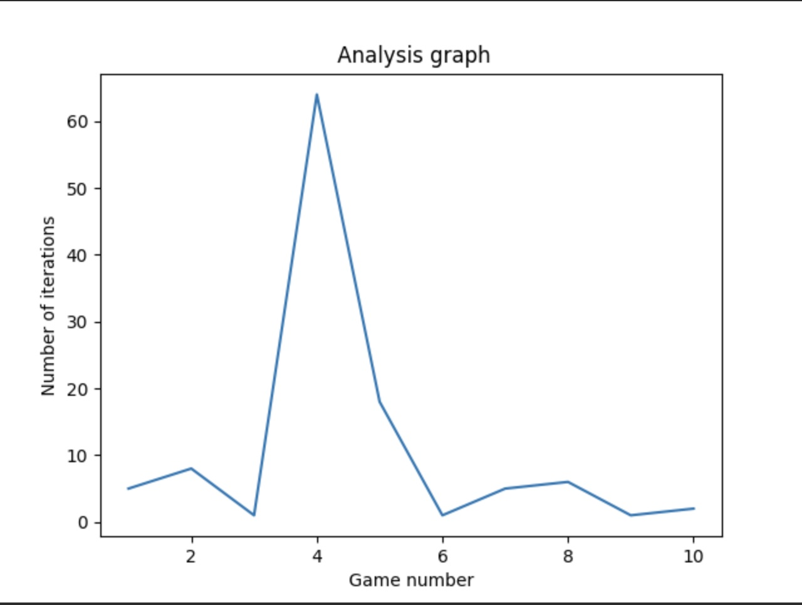
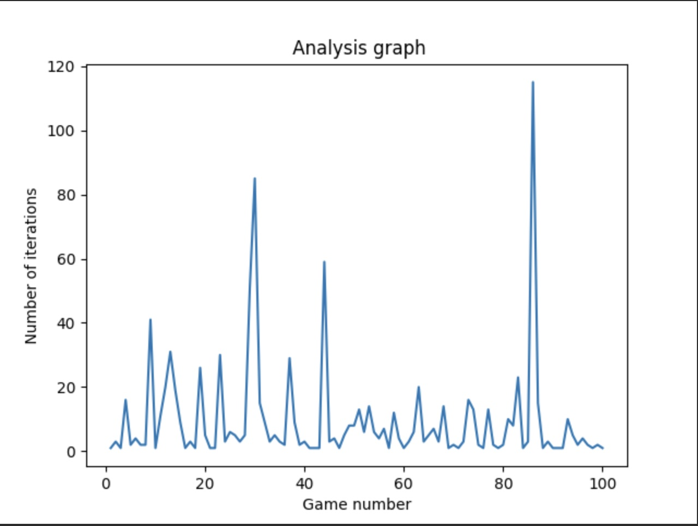

# Title: Sudoku+
 
#### This is a classic sudoku game in different sizes with a slight twist of variants. As the classic sudoku, each cell has exactly one value from 1 to 9. Each row and column have unique numbers from 1 to 9 as well each 3 X 3 cells if the size is 9X9. We are providing 3 sizes i.e., 4X4 , 9X9 and 16X16 As the difficulty level increases, variants like sandwich, thermos etc., are given as part of the rules. 

## Sanwich rules:
#### As part of sandwich sum of numbers between 1 and 9 is displayed for some of the rows and columns. These hints may help the user to solve the puzzle more easily. The sandwich hint is provided only for the boards with difficulty 3 and above. Since 1 and 2 difficulty can be solved without the sandwich hints

## Thermos rules:
#### For thermos we display the patterns where the numbers are in ascending order. The initial number will always be 1. The initial cell is represented as a circle or bulb and then a line is extended from the initial bulb. The value of the number always increases along the line. The thermos hint is provided only for the boards with difficulty 3 and above. Since 1 and 2 difficulty can be solved without the thermos hints

## Targeted Algorithm Analysis:

#### We have used lists to store both the solved and unsolved puzzle board. This choice was made since the lists are easier to traverse and didn't need any overhead computation.

#### For solver, we are using the SAT solver with CNF rules. The sat solver works incredibly faster for sudoku since the rules of sudoku can be easily converted to CNF rules. One of the difficulty we faced is to integrate the sandwich rules into the SAT solver. As a workaround, we have different method which checks for sandwich rules after the SAT solver outputs the solved board. 

### Runtime complexity Analysis
#### The Big Omega analysis for the solver is Omega(1) since the first solution may be the correct solution for the solver. 

#### The Big Theta analysis for the solver is Theta(m*m) where m is the number of rows in the board. 

#### The Big O analysis for the board is O(infinity) where the board may produce the puzzle boards infinitely.

## Graphs
### For 10 games
 

### For 100 games
#### Eg 1, with more 3 level difficulty

#### Eg 2, with more 4 level difficulty

## Summary of Work
#### Luwei Li : Implemented first part of the project i.e., build the generator and SAT solver for the sudoku that includes for both regular size and different size. Added GUI for the sudoku. 

#### Abhisha: Implemented second part which includes adding the sandwich and thermo variants as well as analysis. Worked on performance improvement and Integrated the variants both in solver as well as GUI.

